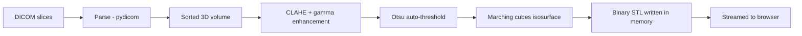

<div align="center">


<br/>


<br/><br/>

<b>Live:</b> <a href="https://dicom-forge.vercel.app">dicom-forge.vercel.app</a>
&nbsp;|&nbsp;
<b>API:</b> <a href="https://dicomforge-api.onrender.com/api/health">dicomforge-api.onrender.com</a>

</div>

---

## What is DICOM, and why forge it

DICOM (Digital Imaging and Communications in Medicine) is the universal file standard for medical imaging. Every CT and MRI machine on earth exports its scans as DICOM: a series of flat, grayscale, two-dimensional slices, each one a thin cross-section of the patient, stacked millimeters apart.

The information in a series is inherently three-dimensional, but the format shows it as dozens of separate frames. A surgeon studying a fracture reads thirty images and reconstructs the geometry mentally.

DicomForge does that reconstruction computationally. Upload a series of slices, and the forge returns a single accurate, watertight 3D STL mesh that can be rotated, sectioned, measured in the browser, and 3D printed. A fracture stops being thirty frames and becomes one object, turned in the hand of the person who has to repair it.

There is no machine learning inside. The pipeline is pure deterministic geometry: the same scan always forges the same mesh.

## The pipeline



| Stage | What happens |
|---|---|
| Parse | Each slice is read with pydicom, validated, rescaled by slope and intercept, and assembled into a sorted volumetric stack using patient position metadata |
| Enhance | Contrast-limited adaptive histogram equalization evens local intensity per slice, then gamma correction lifts faint voxel densities so thin bone walls survive extraction |
| Extract | Otsu's method picks the isosurface level automatically; marching cubes walks the volume and pulls a clean, watertight triangle mesh with correct physical spacing |
| Stream | Vertices, faces and normals are packed straight into a binary STL stream by a hand-written numpy and struct writer. Nothing touches a disk at any point |

## Engineered against constraints

The entire backend was designed to live inside a 512 MB free-tier instance. Constraint was the design brief, not the obstacle.

| Guard | Purpose |
|---|---|
| 40-slice intake cap, enforced client and server | A forge can never exceed the memory ceiling midway |
| Adaptive resolution downsample to 256px | Large-matrix series are reduced before the volume is built |
| 350k face limiter with automatic retry at lower resolution | Output meshes stay streamable and viewable |
| Prebuilt cp311 wheels only, Python pinned to 3.11 | Builds never compile from source, deploys never OOM |
| Zero disk writes | Slices are parsed, processed and discarded in memory; medical data never persists |
| Cold-start aware UX | The deployment sleeps when idle; the interface shows a warming state during the 30 to 60 second wake |

## Tech stack

**Frontend** - Next.js 16 (TypeScript, App Router), Tailwind CSS v4, Motion (Framer Motion), GSAP, Lenis smooth scrolling, three.js with @react-three/fiber and drei, axios. Deployed on Vercel.

**Backend** - Flask 3, gunicorn (single worker, threaded), pydicom, numpy, scipy, scikit-image, PyJWT, Werkzeug password hashing, pymongo. Deployed on Render free tier.

**Database** - MongoDB Atlas (M0), unique-indexed users collection.

**Type and palette** - Clash Display, Syne, Space Grotesk on an ink base with peach and clinical mint accents.

## Experience

<details>
<summary><b>Interface and motion design</b></summary>

<br/>

- Loading sequence: custom angular DF monogram slides in from both sides, expands to the wordmark which fills in sync with a 000 to 100 meter, a wavy crayon strikethrough dims as progress completes, then a soft chromatic bloom reveals the site
- Custom GLSL ferrofluid background: domain-warped fbm noise reacting to cursor position and velocity
- Horizontal stripe page transitions with staggered cover and reveal
- Glyph decypher text animations on titles, menu links, form labels and chat replies
- Blend-difference gradient cursor that inverts over light and dark surfaces
- EVA-style overlay menu with a glowing DF monogram and hover-dim navigation
- Scroll-driven 3D card spirals: a vertical helix walks the pipeline stages, an orbiting ring carries ten practitioner testimonials
- Auth panel with floating decypher labels, drawing underlines, a one-time decrypt of entered values, shake on failure and a drawn check on success

</details>

<details>
<summary><b>The Forge Floor</b></summary>

<br/>

- Stark-style holographic dashboard: central auto-rotating mesh with wireframe glow, scanning ring, holo grid floor and fog
- Slice-scan processing overlay: bars pile into a lens profile while a sweep line passes and status text decyphers through the pipeline stages
- Specimen panel with triangle count, file size, source and forge timestamp; rotation pause for study; STL download
- Archive of nine pre-loaded study models with interactive hover states
- Live greeting with clock and per-user forge statistics
- Forge Guide: a floating assistant with a live 3D icosahedron that quickens while thinking, answering questions about limits, accuracy, privacy and printing

</details>

## API

| Method | Endpoint | Auth | Description |
|---|---|---|---|
| GET | /api/health | none | Service status, used for cold-start warming |
| POST | /api/auth/register | none | Create account, returns JWT and user |
| POST | /api/auth/login | none | Authenticate, returns JWT and user |
| GET | /api/auth/me | bearer | Validate session, returns user |
| POST | /api/forge | bearer | Multipart upload of 8 to 40 .dcm slices, streams binary STL with X-Triangle-Count header |
| POST | /api/chat | none | Forge Guide intent-matched answers |

## Running locally

```text
# backend (Python 3.11)
cd backend
py -3.11 -m venv venv
source venv/Scripts/activate
pip install -r requirements.txt
# create backend/.env from .env.example with MONGO_URI, JWT_SECRET, FRONTEND_ORIGIN
python app.py

# frontend (Node 24)
cd frontend
npm install
# frontend/.env.local -> NEXT_PUBLIC_API_URL=http://localhost:5000
npm run dev
```

A synthetic 36-slice CT-like test series can be generated with `python backend/scripts/make_test_series.py` for end-to-end verification without patient data.

## Structure

```text
DicomForge/
  frontend/   Next.js application (Vercel)
    src/app/            routes: landing, technology, testimonials, faq, access, dashboard
    src/components/     loader, canvas, sections, ui, dashboard, guide
    public/models/      demo STL archive
    public/images/      generated visuals
  backend/    Flask application (Render)
    routes/             auth, forge, chat blueprints
    services/forge.py   the DICOM to STL pipeline
    utils/security.py   JWT issue, verify, guard decorator
    scripts/            synthetic series and demo generators
```

---

<div align="center">
<sub>Built phase by phase, commit by commit. Forged entirely in memory.</sub>
</div>
